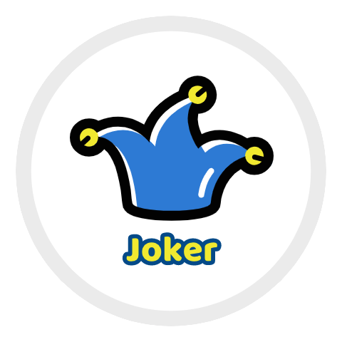

# hexo-theme-joker

  

## 项目开发日志
+ 项目启动 2020/04/13
+ hexo-theme-joker-release-0.1 2020/06/03
## 项目计划

<ul>
  <li><input type="checkbox" checked> 基础框架搭建，包括首页、归档页、关于页</li>
  <h3>以下内容六月底结束</h3>
  <li><input type="checkbox"> 文章页 渲染高亮优化</li>
  <li><input type="checkbox"> 关于页 配置合理</li>
  <li><input type="checkbox"> 添加第三方插件，比如评论、搜索</li>
</ul>

